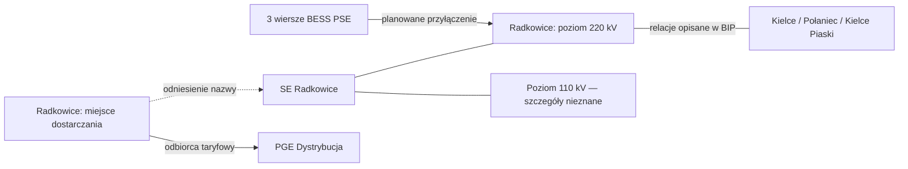

# Radkowice — pierwszy model powiązań dokumentacyjnych

11.09.2026. Działa lokalny generator grafu: **11 obiektów i 10 relacji**. To eksperyment na zachowanych źródłach, nie wdrożenie produkcyjnego silnika sieciowego. Nie wymaga nowej bazy ani dodatkowych bibliotek.

## Nowy dowód PSE/PGE

[Oficjalna taryfa PSE 2026](https://www.pse.pl/documents/20182/7005343691/20260116_Tekst_Taryfy_na_2026_tekst_jednolity.pdf), odczyt 11.09.2026: strona 42 wiąże OSD02 z PGE Dystrybucja, strona 43 wymienia Radkowice jako miejsce dostarczania dla OSD02, typu T i grupy I. Strona 46 wskazuje stan tabeli na **03.12.2025** i dopuszcza zmiany umów bez aktualizacji tabeli. Relacja jest więc potwierdzona dla publikacji, nie jako dzisiejszy schemat ruchowy. Nie dowodzi własności pól ani transformatorów.

Ponowna próba bezpośredniego pliku mocy PGE: HTTP 200, 346 bajtów i brak sygnatury PDF. Zapisano metadane próby w `data/catalog/pge_radkowice_access_2026-09-11.json`; żadne wartości mocy z tej odpowiedzi nie weszły do modelu.

## Co reprezentuje graf

Użytkownik doprecyzował roboczy podział: część 110 kV — PGE, część 220 kV — PSE; granica przypuszczalnie w rejonie transformacji. Zachowano to w `data/project/radkowice_user_claims.json` i kontekście grafu jako informację użytkownika, nie dowód operatora. Dokładne zaciski, pola oraz właściciel autotransformatora pozostają do potwierdzenia. Wyszukiwanie z 11.09.2026 nie dostarczyło schematu granic dla Radkowic; nie rozstrzygamy tego przez analogię do innych stacji.

| Obiekt/relacja | Znaczenie | Czego nie oznacza |
|---|---|---|
| STATION_REFERENCE | Stacja nazwana w dokumencie | Pełna ewidencja urządzeń |
| VOLTAGE_LEVEL_REFERENCE | Potwierdzony poziom 220 lub 110 kV | Konkretna sekcja szyn, pole lub punkt fizyczny |
| REPORTED_LINE | Relacja do Kielc, Połańca lub Kielc Piaski opisana w BIP | Znany aktualny stan łączników i obciążalność |
| PROJECT_RECORD | Wiersz PSE dotyczący BESS | Ostatecznie rozstrzygnięta tożsamość inwestycji we wszystkich źródłach |
| PLANNED_CONNECTION | Wskazanie Radkowic 220 kV i umowy przyłączeniowej | Potwierdzone wykonanie przyłączenia |
| DELIVERY_POINT_REFERENCE | Miejsce dostarczania z taryfy | Identyfikator konkretnego transformatora |
| TARIFF_RECIPIENT | Odbiorca usług wskazany przez PSE | Właściciel całej stacji |



Strzałki opisują relacje dokumentacyjne, nie kierunki przepływów energii. Schemat nie wstawia brakujących transformatorów ani feederów. Dla grafu obowiązuje `power_flow_ready=false`.

## Uruchamianie i kontrola

Po przywróceniu wcześniejszych snapshotów XLSX/PDF i taryfy:

```powershell
python scripts/build_radkowice_graph.py
python -m unittest discover -s tests -p test_evidence_graph.py -v
```

Wynik: `data/reference/radkowice_evidence_graph_v1.json`. Każdy obiekt i relacja zawiera źródło, hash snapshotu, lokalizator, datę stanu i pobrania. Nieznany okres obowiązywania pozostaje null. Generator sprawdza hashe PDF oraz porównuje zapisany wycinek projektów z ponownym odczytem oryginalnego XLSX. Zmieniona próbka nie przechodzi bez ponownej weryfikacji.

Walidator wykrywa brak dowodu, duplikaty ID, nieistniejące końce relacji, sprzeczne oznaczenie przyłączenia planowanego i próbę uznania grafu za model rozpływowy. Nie jest uniwersalnym walidatorem przyszłego schematu; nie potwierdza jeszcze poprawności każdej wartości elektrycznej ani kompletności topologii.

## Następny etap

Rozstrzygnąć legalny zakres użycia źródeł pilota, uzyskać potwierdzone dane PGE i rozwinąć model obserwacji oraz wniosków. KSE-014 i KSE-018 pozostają osobnymi zadaniami pełnego pilota; prototyp nie spełnia wszystkich ich kryteriów. Taryfa nie zastępuje tych braków. Nowy PDF zachowano w `data/archives/radkowice_tariff_2026-09-11.zip`; manifest `data/catalog/radkowice_tariff_archive.json` wskazuje sprawdzone hashe. Paczka pozostaje lokalna, bez potwierdzonej kopii zewnętrznej.
